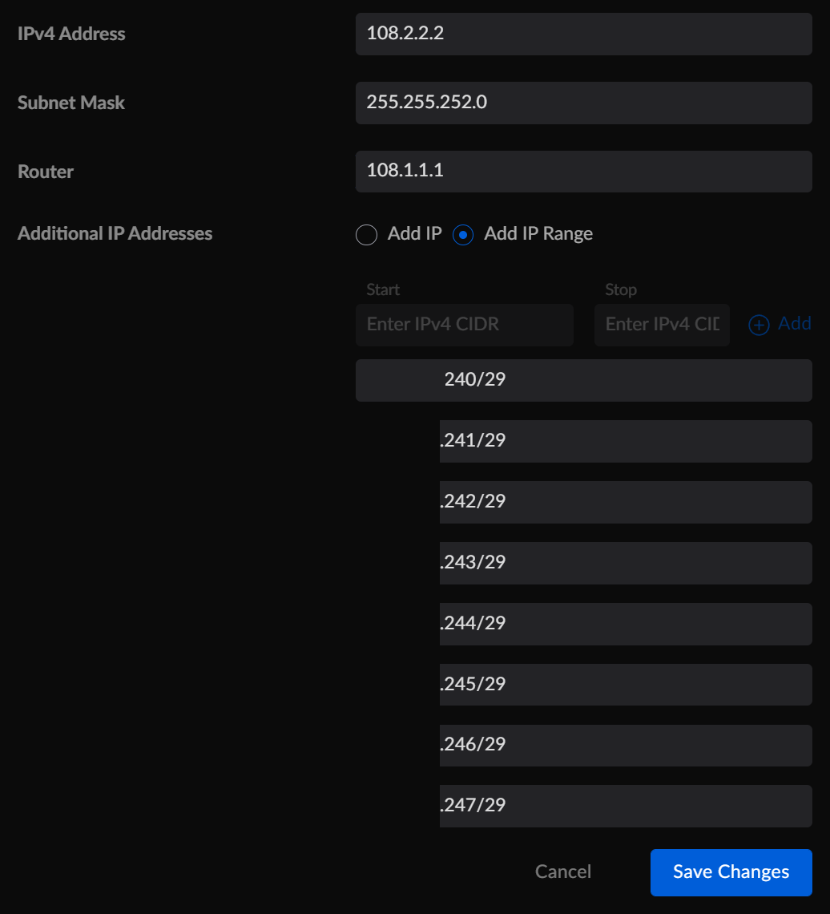

#ATT Fiber Static Ips w/ UDM/P

### With this trick you will be able to

1. Use your whole CIDR (not just the 5 that ATT claims)
2. Get an extra public ip in your DHCP one


### How this works
I tore through how IP Passthrough and Cascaded Routers worked in ATT Gateways and I discovered how they use these.  This  emulates a Cascaded Router setup. Also you get the bonus of being able to assign your DHCPv4 IP to any interface you want.  I personally assign egress IPs to my networks and use port forwarding for the rest, however, if you wanted you could make a new network with your Public IP CIDR and let the DHCP server hand out addresses that way as well.
### Steps
1. Setup your internet connection via DHCP v4 as you usually would. 
2. Get your current ip

   ```shell
   curl ifconfig.co
   108.2.2.2
   ```

3. Trace route from UDMP to get your Gateway
   ```shell
   traceroute to 8.8.8.8 (8.8.8.8), 30 hops max, 46 byte packets
   1  108-x-x-x.lxxxxxxxx (108.2.2.2)  0.343 ms  0.492 ms  0.376 ms  <----- Default Gateway
   ```
4. Discover the subnet for your DHCP ip
   Run "ip a", goto your WAN ip interface You will see your public ip with a CIDR, that CIDR denotes your subnet mask   
   https://docs.netgate.com/pfsense/en/latest/network/cidr.html
   ```shell
   eth8: <BROADCAST,MULTICAST,UP,LOWER_UP> mtu 1500 qdisc mq state UP group default qlen 1000
   link/ether  brd ff:ff:ff:ff:ff:ff
   inet 108.2.2.2/22 scope global eth8
   valid_lft forever preferred_lft forever
   ```
    our subnet mask is gateway is /22 ```255.255.252.0```

5. Setup your internet with a static ip.  Use your dynamic ip you usually get, the gateway /subnet mask we found above. Also, add each one of your static IP's by hand, if you try to add them by range the UI CIDR knows that some of those should be broadcast / router etc

Example: 




Save and it should work.
However if it does not, or later you randomly lose your internet there is a reason from this.
Your route out the internet is your DHCPv4 lease.  You may need to renew it.  To do this switch back to dhcpv4 and save, then switch back to static ip OR do this from the command line

```
# udhcpc -i eth8
udhcpc: started, v1.34.1
udhcpc: broadcasting discover
sh: /usr/share/udhcpc/decline.script: not found
udhcpc: broadcasting select for 108.2.2.2, server 108.1.1.1
udhcpc: lease of 108.2.2.2 obtained from 108.1.1.1., lease time 3600
```